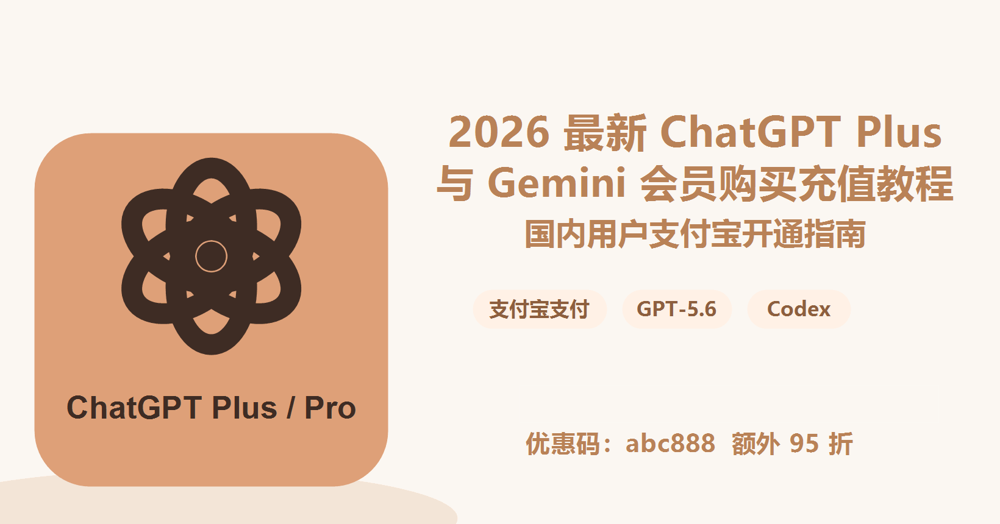

# 2026 最新 ChatGPT Plus / Pro 与 Gemini 会员购买充值教程：国内用户支付宝开通指南，支持 GPT-5.6、Codex、Gemini Pro

> 更新时间：2026 年 7 月  
> 适合人群：国内新手用户、学生、设计师、运营、程序员、跨境电商从业者、自媒体创作者、AI 工具重度用户  
> 关键词：ChatGPT 账号充值、ChatGPT Plus 充值、ChatGPT 代充、GPT 充值、GPT Plus 购买、GPT Pro 购买、Codex 使用、Gemini Pro 购买、Gemini 会员充值、支付宝购买 ChatGPT Plus

如果你正在搜索：

- ChatGPT Plus 怎么充值？
- 国内怎么购买 ChatGPT 会员？
- ChatGPT Plus 能不能用支付宝付款？
- GPT-5.6 怎么开通？
- Codex 是不是需要 ChatGPT Plus 或 Pro？
- Gemini Pro / Google AI Pro 国内怎么购买？
- 没有海外信用卡，怎么订阅 ChatGPT Plus？
- 充值 ChatGPT 会员安全吗？会不会封号？

这篇文章就是写给你的。

本文会尽量用小白能看懂的方式，把 ChatGPT Plus、ChatGPT Pro、Codex、Gemini Pro / Google AI Pro 的会员购买、充值方式、适合人群、支付问题、风险提醒、常见报错和售后注意事项一次讲清楚。[购买入口](https://nf.video/YmYHQ)  

如果你只是想快速开通会员，不想折腾海外银行卡、虚拟信用卡、美国账单地址、App Store 礼品卡、Google Play 地区限制，可以直接查看本文的「推荐方案」部分。购买时可以使用优惠码 `abc888`，输入后可额外享受 95 折优惠。

> 重要说明：本文是用户视角的购买与充值经验整理，不代表 OpenAI、Google 或 Gemini 官方。ChatGPT、OpenAI、Codex、Gemini、Google AI 等名称和商标归对应公司所有。具体价格、模型权限、地区可用性和使用额度，请以官方页面和你账号内显示为准。

---

## 目录

- [为什么国内用户充值 ChatGPT Plus 经常失败](#为什么国内用户充值-chatgpt-plus-经常失败)
- [ChatGPT Plus、ChatGPT Pro、Codex、Gemini Pro 到底是什么](#chatgpt-pluschatgpt-procodexgemini-pro-到底是什么)
- [GPT-5.6 和 Codex 是否需要开通会员](#gpt-56-和-codex-是否需要开通会员)
- [国内用户常见的 5 种充值方式对比](#国内用户常见的-5-种充值方式对比)
- [推荐方案：支付宝自助购买 ChatGPT Plus / Pro 或 Gemini 会员](#推荐方案支付宝自助购买-chatgpt-plus--pro-或-gemini-会员)
- [ChatGPT Plus 充值详细步骤](#chatgpt-plus-充值详细步骤)
- [Gemini Pro / Google AI Pro 购买详细步骤](#gemini-pro--google-ai-pro-购买详细步骤)
- [如何判断一个充值平台是否靠谱](#如何判断一个充值平台是否靠谱)
- [ChatGPT Plus、Pro、Gemini Pro 该怎么选](#chatgpt-plusprogemini-pro-该怎么选)
- [充值前必须注意的账号安全事项](#充值前必须注意的账号安全事项)
- [常见报错与解决方法](#常见报错与解决方法)
- [新手 FAQ](#新手-faq)
- [适合收藏的简短结论](#适合收藏的简短结论)

---

## 为什么国内用户充值 ChatGPT Plus 经常失败

很多人以为 ChatGPT Plus 充值很简单：打开 ChatGPT 官网，点升级，输入银行卡，付款，然后就能用了。

但国内用户真正操作时，通常会卡在支付环节。

常见情况包括：

### 1. 国内银行卡无法直接订阅

ChatGPT Plus 官方订阅通常需要支持国际支付的银行卡或其他受支持的支付方式。很多国内发行的银行卡、借记卡、部分信用卡，在提交付款时会出现：

- Your card was declined
- We are unable to authenticate your payment method
- Payment failed
- 付款未完成
- 银行卡被拒绝
- 支付方式不可用

这不是你不会操作，而是支付环境、卡段、账单地址、风控策略、地区支持等因素叠加导致的。

### 2. 有 Visa / Mastercard 也不一定成功

不少用户明明有 Visa 或 Mastercard 信用卡，仍然无法成功升级 ChatGPT Plus。

原因可能包括：

- 卡片不支持海外线上订阅
- 银行拦截了跨境交易
- 账单地址和支付地区不匹配
- 支付环境频繁切换导致风控
- OpenAI 或支付服务商暂时拒绝该卡段

所以「有外币卡」不等于「一定能开通」。

### 3. App Store / Google Play 方式门槛较高

有些用户会尝试通过 iPhone、iPad 或 Android 应用内购买。但这条路也有不少限制：

- Apple ID 或 Google 账号地区需要匹配
- 礼品卡可能存在黑卡、锁区、余额冻结风险
- 切换 Apple ID 地区会影响原有订阅
- Google Play 在国内环境下操作更复杂
- 失败后退款和售后周期可能较长

对普通新手来说，这条路并不省心。

### 4. 虚拟信用卡越来越难用

以前很多人会用海外虚拟信用卡订阅 ChatGPT Plus。现在虚拟卡平台门槛明显提高：

- 需要 KYC 实名认证
- 充值手续费高
- 卡段经常被风控
- 可能只支持加密货币充值
- 平台跑路或冻结余额的风险无法忽视

如果你只是想开一个 ChatGPT Plus，每个月用来写作、学习、办公、编程，专门去研究虚拟卡并不划算。

### 5. 不知道代充、直充、共享账号有什么区别

搜索「ChatGPT 代充」的人，大多不是想钻空子，而是想解决一个很朴素的问题：

> 我没有海外支付方式，但我想用自己的 ChatGPT 账号开通 Plus 或 Pro，有没有更简单的办法？

这就涉及几种完全不同的购买方式：

- 官方直充：自己用官方支持的支付方式订阅
- 自助代充：通过第三方服务，用人民币支付，协助开通到自己的账号
- 卡密兑换：购买对应服务的兑换码或充值码
- App 内购：通过 Apple / Google 生态订阅
- 共享账号：多人共用一个账号，风险最高，不推荐

下面逐一讲清楚。

---

## ChatGPT Plus、ChatGPT Pro、Codex、Gemini Pro 到底是什么

在充值之前，先把几个概念弄清楚，能少花很多冤枉钱。

### ChatGPT Free

免费版适合轻度体验，比如：

- 日常问答
- 简单翻译
- 基础写作
- 灵感 brainstorming
- 少量图片或文件相关功能

缺点是模型权限、使用次数、速度和高峰期稳定性通常不如付费版。

### ChatGPT Plus

ChatGPT Plus 是面向个人用户的付费订阅。根据 OpenAI 官方帮助中心说明，Plus 是月付订阅，官方价格通常为 20 美元/月，具体权益以账号内显示为准。

Plus 通常适合：

- 想稳定使用更强模型的普通用户
- 需要更高消息额度的人
- 写论文、写简历、写公众号、做翻译的人
- 需要文件分析、图片生成、语音、联网搜索等功能的人
- 编程学习者和轻中度开发者

如果你只是个人使用，ChatGPT Plus 往往是最常见、最划算的选择。

### ChatGPT Pro

ChatGPT Pro 是更高阶的个人订阅，适合高强度用户。

更适合：

- 程序员、产品经理、数据分析师
- AI 重度用户
- 高频使用复杂推理模型的人
- 长时间做研究、代码、文档、自动化任务的人
- 想要更高额度和更强模型访问权限的人

如果你每天都要用 AI 工作，而且经常遇到 Plus 额度不够，才建议考虑 Pro。

### Codex

Codex 是 OpenAI 面向代码、软件开发、自动化任务的能力和产品形态之一。你可以把它理解成更适合程序员、开发者和技术团队的 AI 编程助手。

Codex 常见用途包括：

- 阅读代码仓库
- 修改代码
- 修 bug
- 写测试
- 解释项目结构
- 生成脚本
- 重构代码
- 辅助开发网站、工具、小程序、自动化流程

如果你不是程序员，也可以用 Codex 做一些自动化、网页、文档处理类任务。但如果你主要只是聊天、写作、翻译、总结，ChatGPT Plus 就已经够用了。

### Gemini / Gemini Pro / Google AI Pro

Gemini 是 Google 的 AI 产品。很多人说的「Gemini Pro」在实际购买场景里，通常指 Google AI Pro 这类 Gemini 付费会员。

Gemini 更适合：

- 深度使用 Google 生态的人
- 经常用 Gmail、Google Docs、Google Drive、YouTube、Google Search 的用户
- 需要长上下文处理的人
- 需要和 Google 工具配合办公的人

如果你平时更依赖 Google 生态，可以考虑 Gemini Pro / Google AI Pro；如果你更常用 ChatGPT、Codex、GPT 模型和 OpenAI 工具，则优先考虑 ChatGPT Plus 或 Pro。

---

## GPT-5.6 和 Codex 是否需要开通会员

截至 2026 年 7 月，OpenAI 已在官方页面和帮助中心说明 GPT-5.6 正在向符合条件的付费 ChatGPT 方案推出，并且 GPT-5.6 可用于 ChatGPT、Codex 和 OpenAI API 等场景。不同账号、地区、套餐、工作区设置可能存在差异。

简单说：

- 想体验更高阶的 GPT-5.6 能力，通常需要符合条件的付费账号
- Plus、Pro、Business、Enterprise 等方案的可用模型和额度可能不同
- Codex 的可用性、版本要求、额度也可能跟账号方案有关
- 如果模型选择器里没有 GPT-5.6，可能是还没完全开放、账号不符合条件、地区或工作区策略限制

所以你在购买前要确认两点：

1. 你要买的是 ChatGPT Plus 还是 ChatGPT Pro；
2. 你当前账号里是否已经显示对应模型或功能入口。

如果你是新手，不确定买哪个，建议先从 Plus 开始。真的用到额度不够，再升级 Pro。

---

## 国内用户常见的 5 种充值方式对比

| 方式 | 难度 | 到账速度 | 账号安全 | 适合人群 | 推荐程度 |
| --- | --- | --- | --- | --- | --- |
| 官方海外银行卡直充 | 高 | 快 | 高 | 有稳定海外支付方式的人 | 推荐，但门槛高 |
| 海外虚拟信用卡 | 高 | 不稳定 | 中 | 有经验、能接受 KYC 和手续费的人 | 一般 |
| App Store / Google Play | 中高 | 中 | 中高 | 熟悉苹果或 Google 生态的人 | 可选 |
| 第三方自助代充 | 低 | 快 | 取决于平台 | 没有海外卡、想用支付宝的人 | 新手更省心 |
| 共享账号 | 低 | 快 | 低 | 只想临时体验且不在意隐私的人 | 不推荐 |

一句话总结：

> 有海外支付方式，优先官方直充；没有海外支付方式，又想用自己的账号开通会员，可以考虑靠谱的自助充值服务；不要购买共享账号。

---

## 推荐方案：支付宝自助购买 ChatGPT Plus / Pro 或 Gemini 会员

如果你是国内用户，没有海外信用卡，又不想折腾虚拟卡、礼品卡、切区、IP 环境，那么最省心的方式通常是：

> 使用支持支付宝的自助充值服务，购买 ChatGPT Plus、ChatGPT Pro、Codex 相关会员或 Gemini Pro / Google AI Pro 会员。

推荐入口如下：

> 购买入口：[https://nf.video/YmYHQ](https://nf.video/YmYHQ)  
> 优惠码：`abc888`，下单时输入可额外 95 折  
> 支持服务：ChatGPT Plus、ChatGPT Pro、Gemini Pro / Google AI Pro、Codex 相关账号咨询  
> 支付方式：支付宝  
> 到账说明：以页面展示为准，通常自助订单会比人工代充更快

### 为什么新手更适合自助充值

对小白用户来说，自助充值最大的价值不是便宜，而是省时间：

- 不需要自己申请海外信用卡
- 不需要研究虚拟卡平台
- 不需要 KYC
- 不需要购买礼品卡
- 不需要反复尝试账单地址
- 不需要研究支付失败报错
- 直接用支付宝付款
- 按页面提示完成操作
- 购买后在自己的账号里使用

尤其是很多人只是想开通一个月 ChatGPT Plus，用来写作、学习、做 PPT、写代码、做跨境电商素材、生成图片、分析文件。为此专门研究一套海外支付方案，时间成本太高。

### 推荐自助充值而不是共享账号

请注意：自助充值和共享账号不是一回事。

自助充值的目标是帮你自己的账号开通会员；共享账号是很多人共用一个账号。

共享账号的问题非常明显：

- 聊天记录可能被别人看到
- 账号可能频繁异地登录
- 使用额度容易被别人占用
- 密码随时可能被改
- 一旦被封，几乎没有保障
- 工作资料、代码、合同、简历、论文都不适合放进去

如果你要长期使用 AI，建议尽量用自己的账号。

---

## ChatGPT Plus 充值详细步骤

下面以「支持支付宝的自助充值服务」为例，讲一个小白也能照着做的流程。

### 第一步：准备一个自己的 ChatGPT 账号

你需要先有一个 ChatGPT 账号。

准备事项：

- 一个可以正常登录的邮箱
- 能打开 ChatGPT 的网络环境
- 账号没有异常风控提示
- 最好开启账号的双重验证
- 确认自己记得登录方式，例如邮箱登录、Google 登录、Apple 登录或 Microsoft 登录

如果你还没有 ChatGPT 账号，可以先去 ChatGPT 官网注册。注册完成后，确认能正常进入聊天页面，再开始购买会员。

### 第二步：确认要购买 Plus 还是 Pro

新手建议：

- 第一次购买：先买 ChatGPT Plus
- 高频工作用户：考虑 ChatGPT Pro
- 程序员或开发者：根据 Codex 使用需求选择 Plus 或 Pro
- 不确定：先买一个月 Plus 试用

不要一上来就买最贵套餐。先确认你真的会高频使用，再考虑升级。

### 第三步：打开购买入口

打开下面这个购买入口：

[https://nf.video/YmYHQ](https://nf.video/YmYHQ)

下单时如果页面有优惠码输入框，填写：

`abc888`

使用优惠码后，可以额外享受 95 折优惠。

进入页面后，通常会看到：

- ChatGPT Plus 月卡
- ChatGPT Pro 月卡
- Gemini Pro / Google AI Pro
- 其他 AI 工具订阅
- 订单说明
- 支付方式
- 售后规则

购买前请认真看清楚套餐名称，不要把 Plus、Pro、共享账号、API 额度混淆。

### 第四步：选择 ChatGPT Plus 套餐

如果你是普通用户，建议选择：

- ChatGPT Plus 月卡
- 使用自己的账号
- 支持支付宝付款
- 不购买共享账号

如果页面上有多个选项，请特别注意这些词：

- 自用账号升级
- 独享账号
- 共享账号
- API 额度
- ChatGPT Plus
- ChatGPT Pro
- Gemini Pro

新手最容易买错的是把 API 额度当成 ChatGPT Plus。API 是开发者调用接口用的，不等于 ChatGPT 网页会员。

### 第五步：用支付宝付款

付款前核对：

- 商品名称是否正确
- 购买周期是否正确
- 是否支持售后
- 是否需要提供账号密码
- 是否说明到账时间
- 是否有订单说明

建议优先选择「不需要提供账号密码」的模式。如果任何商家要求你直接提交 ChatGPT 账号密码，一定要谨慎。

### 第六步：按页面提示完成验证或绑定

不同平台流程可能不同，常见方式包括：

- 输入账号邮箱
- 跳转官方授权页面
- 通过一次性链接完成绑定
- 使用平台生成的充值码或卡密
- 按客服指引完成开通

无论是哪种方式，都要记住一个原则：

> 尽量不要把 ChatGPT 登录密码发给任何陌生人。

如果必须人工协助，建议先修改临时密码，完成后立刻改回，并开启双重验证。

### 第七步：登录 ChatGPT 查看会员状态

充值完成后，打开 ChatGPT：

1. 登录自己的账号；
2. 查看左下角或设置里的套餐状态；
3. 打开模型选择器；
4. 查看是否显示 Plus / Pro 权益；
5. 尝试使用文件上传、图片生成、语音、深度研究或 GPT-5.6 相关模型；
6. 如果没显示，退出重新登录或等待几分钟。

如果仍然没有到账，及时联系售后，并提供订单号和账号邮箱。

---

## Gemini Pro / Google AI Pro 购买详细步骤

Gemini 会员和 ChatGPT 会员不是同一个体系。

ChatGPT 属于 OpenAI，Gemini 属于 Google。购买前一定要确认自己要买哪个。

### Gemini Pro 适合哪些人

如果你经常使用这些产品，Gemini Pro / Google AI Pro 可能更适合你：

- Gmail
- Google Docs
- Google Drive
- Google Sheets
- Google Search
- YouTube
- Android 手机
- Chrome 浏览器
- Google Workspace

Gemini 的优势通常在于 Google 生态整合、长上下文处理和办公场景协同。

### 购买前准备

购买 Gemini Pro / Google AI Pro 前，请确认：

- 你有一个可以正常登录的 Google 账号
- 账号地区和付款方式不会冲突
- 你知道自己要买的是 Gemini 会员，而不是 ChatGPT
- 你接受 Google 账号相关订阅规则
- 你能正常访问 Gemini 页面

### 支付宝购买 Gemini 会员流程

如果使用自助服务，一般流程是：

1. 打开购买入口；
2. 选择 Gemini Pro / Google AI Pro 套餐；
3. 核对购买周期；
4. 使用支付宝付款；
5. 按页面提示完成账号绑定或兑换；
6. 登录 Gemini 查看会员权益是否生效。

购买入口：

[https://nf.video/YmYHQ](https://nf.video/YmYHQ)

优惠码：

`abc888`

购买时输入优惠码，可额外享受 95 折优惠。

### Gemini 购买后如何检查是否成功

可以从这些地方确认：

- Gemini 页面是否显示 Pro / Advanced / Google AI Pro 相关标识
- 是否可以使用更高阶模型
- 是否有更高使用额度
- Google One 或 Google AI 订阅页面是否显示有效订阅
- 订单邮箱是否收到确认信息

如果没有到账，先不要重复下单，及时联系客服查询。

---

## 如何判断一个充值平台是否靠谱

这是最重要的部分。

充值平台不是越便宜越好。很多低价服务看起来诱人，但可能存在盗刷、黑卡、共享账号、跑路、无售后等问题。

建议从以下几个方面判断。

### 1. 是否明确说明商品类型

靠谱的平台会把商品写清楚：

- ChatGPT Plus
- ChatGPT Pro
- Gemini Pro / Google AI Pro
- 自用账号升级
- 共享账号
- API 额度
- 购买周期
- 到账时间
- 售后规则

如果页面只写「GPT 会员」「AI 会员」「高级账号」，但不说清楚是什么，建议谨慎。

### 2. 是否支持支付宝正规付款

对国内用户来说，支付宝付款更方便，也更容易留存支付记录。

建议保留：

- 订单截图
- 支付宝付款记录
- 商品页面截图
- 客服聊天记录
- 账号邮箱
- 到账截图

这些信息能在售后时节省很多沟通成本。

### 3. 是否不要求提供账号密码

优秀的自助服务，通常会尽量避免让用户提交账号密码。

如果某个商家一上来就要求：

- 发 ChatGPT 邮箱
- 发 ChatGPT 密码
- 发 Google 账号密码
- 关闭双重验证
- 提供验证码

一定要提高警惕。

如果确实需要人工协助，也建议使用临时密码，完成后立即修改，并检查账号安全设置。

### 4. 是否有明确售后

购买前先确认：

- 充值失败是否退款
- 多久不到账可以联系
- 账号异常是否协助处理
- 续费失败怎么办
- 是否支持订单查询
- 客服响应时间

没有售后的低价服务，不建议购买。

### 5. 是否长期运营

判断一个服务是否稳定，可以看：

- 域名是否长期存在
- 页面是否持续更新
- 是否有用户评价
- 是否有明确联系方式
- 是否有订单系统
- 是否有常见问题页面
- 是否持续维护说明文档

低价、无站点、只靠私聊收款、没有售后的个人代充，风险通常更高。

### 6. 是否避免夸张承诺

如果商家承诺：

- 永久会员
- 绝对不封号
- 无限使用
- 低价到明显不合理
- 官方内部渠道
- 100% 永不掉订阅

建议谨慎。

AI 订阅服务本身会受官方政策、支付风控、地区、账号状态影响，没有人能对所有情况做绝对保证。

---

## ChatGPT Plus、Pro、Gemini Pro 该怎么选

### 普通用户：优先 ChatGPT Plus

如果你的需求是：

- 写作
- 翻译
- 总结文档
- 做 PPT 大纲
- 写简历
- 学英语
- 写邮件
- 处理 Excel 思路
- 生成图片
- 日常问答

选 ChatGPT Plus 就可以。

### AI 重度用户：考虑 ChatGPT Pro

如果你每天都在用 AI 工作，比如：

- 长时间写代码
- 批量处理文档
- 做复杂研究
- 需要更高推理能力
- 经常遇到额度不够
- 需要更强模型和更高使用上限

可以考虑 ChatGPT Pro。

### 程序员：关注 Codex 和模型额度

如果你是开发者，建议关注：

- Codex 是否可用
- GPT-5.6 相关模型是否出现在账号里
- 推理模型额度是否够用
- 是否需要处理完整代码仓库
- 是否经常跑长任务
- 是否需要桌面端或 CLI

轻度写代码：Plus 够用。  
重度开发：可以考虑 Pro。

### Google 生态用户：考虑 Gemini Pro / Google AI Pro

如果你的工作围绕 Google 生态：

- Gmail
- Docs
- Sheets
- Drive
- YouTube
- Search
- Android

Gemini Pro / Google AI Pro 可能更顺手。

### 不确定怎么选

建议顺序：

1. 先买 ChatGPT Plus 一个月；
2. 如果经常写代码，再尝试 Codex；
3. 如果额度不够，再升级 Pro；
4. 如果你重度使用 Google 生态，再补 Gemini Pro。

---

## 充值前必须注意的账号安全事项

无论你买 ChatGPT Plus、ChatGPT Pro 还是 Gemini Pro，都建议先做好账号安全。

### 1. 使用自己的账号

尽量不要买共享账号。

自己的账号好处是：

- 聊天记录归自己
- 文件和项目更安全
- 不会被陌生人占用额度
- 可以长期续费
- 可以积累个性化使用习惯

### 2. 开启双重验证

如果平台支持，建议开启双重验证。

ChatGPT 账号、Google 账号都很重要，尤其是你会上传：

- 工作文档
- 代码
- 合同
- 论文
- 简历
- 客户资料

账号安全比省几十块钱更重要。

### 3. 不要随便提交密码

任何需要你提交密码的服务，都要谨慎。

如果无法避免，建议：

1. 充值前改成临时密码；
2. 完成后立刻改回；
3. 检查登录设备；
4. 开启双重验证；
5. 不要把验证码发给陌生人。

### 4. 不要购买明显低价的黑卡服务

如果价格远低于正常成本，要小心来源问题。

风险包括：

- 订阅被取消
- 账号被风控
- 无法续费
- 商家失联
- 付款无法追回

### 5. 保留订单记录

购买后请保存：

- 订单号
- 支付截图
- 商品页面截图
- 账号邮箱
- 到账截图
- 客服聊天记录

售后时这些信息非常重要。

---

## 常见报错与解决方法

### 报错 1：Your card was declined

含义：银行卡被拒绝。

可能原因：

- 银行不支持该笔海外订阅
- 卡段被支付系统拒绝
- 账单地址不匹配
- 余额不足
- 风控拦截

解决方法：

- 换一张支持海外支付的卡
- 联系银行确认是否拦截
- 检查账单地址
- 使用官方支持的其他支付方式
- 没有海外卡的用户，可以考虑支付宝自助充值服务

### 报错 2：Payment failed

含义：支付失败。

解决方法：

- 刷新页面后重试
- 更换浏览器
- 清理缓存
- 检查网络环境
- 不要频繁提交付款
- 失败次数过多时等待一段时间

### 报错 3：We are unable to authenticate your payment method

含义：支付方式无法验证。

可能原因：

- 3D Secure 验证失败
- 银行验证未通过
- 支付地区不匹配
- 卡片不支持订阅扣款

解决方法：

- 联系发卡银行
- 换卡
- 检查账单地址
- 使用其他充值方式

### 报错 4：订阅成功但账号没显示 Plus

解决方法：

1. 退出 ChatGPT 重新登录；
2. 刷新网页；
3. 检查是否登录了正确邮箱；
4. 查看订阅管理页面；
5. 等待几分钟；
6. 联系客服并提供订单号。

### 报错 5：模型列表里没有 GPT-5.6

可能原因：

- 账号套餐暂不支持
- 功能仍在逐步开放
- 所在工作区管理员关闭了模型
- 当前客户端版本太旧
- 账号地区或风控状态影响

解决方法：

- 检查账号是否为符合条件的付费方案
- 更新 ChatGPT App 或桌面端
- 查看模型选择器
- 等待官方逐步开放
- 联系官方支持或购买渠道客服确认

### 报错 6：Codex 无法使用

可能原因：

- 当前账号没有相关权限
- 客户端版本过旧
- 没有登录正确账号
- 工作区设置限制
- 使用环境不满足要求

解决方法：

- 更新 ChatGPT 桌面端或 Codex CLI
- 确认登录的是已开通会员的账号
- 查看账号套餐权益
- 检查官方帮助文档

### 报错 7：Gemini 会员购买后没生效

解决方法：

- 确认登录的是购买时使用的 Google 账号
- 检查 Google One / Google AI 订阅页面
- 刷新 Gemini 页面
- 等待订阅同步
- 不要重复购买
- 联系购买渠道客服

### 报错 8：账号提示异常登录

解决方法：

- 立即修改密码
- 退出所有设备
- 开启双重验证
- 检查最近登录记录
- 不要继续使用共享账号

### 报错 9：充值后无法续费

可能原因：

- 原支付方式失效
- 卡片被拒
- 订阅到期
- 平台服务调整
- 官方政策变化

解决方法：

- 提前几天续费
- 查看订阅到期时间
- 联系原购买渠道
- 必要时更换支付方式

### 报错 10：买错了 API 额度

很多新手会混淆 ChatGPT Plus 和 OpenAI API。

区别很简单：

- ChatGPT Plus：网页登录 ChatGPT 使用的会员
- OpenAI API：开发者写程序调用模型用的余额或账单

如果你只是想在 ChatGPT 网页或 App 里聊天、写作、上传文件，不要买 API 额度。

---

## 新手 FAQ

### Q1：ChatGPT Plus 是官方会员吗？

ChatGPT Plus 是 OpenAI 的官方订阅方案。通过任何第三方购买时，都要确认最终是否开通到你自己的 ChatGPT 账号里，并且不要轻信「官方代理」「内部渠道」等无法验证的说法。

### Q2：支付宝能直接在 OpenAI 官网付款吗？

通常不能直接用国内支付宝在 OpenAI 官网完成 ChatGPT Plus 订阅。支付宝更多出现在第三方自助充值、礼品卡或其他间接购买场景中。

### Q3：代充安全吗？

取决于平台。

更安全的做法是：

- 使用自己的账号
- 选择不需要密码的自助流程
- 保留订单记录
- 不买共享账号
- 不碰明显低价黑卡
- 选择有售后的长期服务

### Q4：充值 ChatGPT Plus 会不会封号？

没有任何第三方可以保证 100% 不出现账号问题。一般来说，使用自己的账号、避免共享账号、避免异常登录、避免黑卡和盗刷来源，风险会低很多。

### Q5：共享账号为什么不推荐？

因为共享账号存在隐私和稳定性问题。

你输入的内容可能被别人看到，别人也可能占用额度。多人异地登录还容易触发风控。工作、学习、写论文、写代码都不建议用共享账号。

### Q6：ChatGPT Plus 和 Pro 有什么区别？

Plus 更适合普通个人用户，价格更低，功能已经很完整。Pro 面向高强度用户，通常有更高额度和更强模型访问能力。

新手建议先买 Plus。

### Q7：GPT-5.6 是不是所有 Plus 用户都有？

不一定。模型开放会受套餐、地区、账号状态、工作区设置和官方逐步开放节奏影响。购买前后都应以你账号内模型选择器显示为准。

### Q8：Codex 是不是必须买 Pro？

不一定。Codex 的权限和额度可能随账号方案变化。轻度开发者可以先用 Plus 试试；如果经常处理复杂代码任务，再考虑 Pro。

### Q9：Gemini Pro 和 ChatGPT Plus 买哪个？

看你的使用场景。

- 更常用 ChatGPT、GPT、Codex：选 ChatGPT Plus
- 更常用 Google Docs、Gmail、Drive、YouTube：考虑 Gemini Pro / Google AI Pro
- 两边都重度使用：可以都买，但先按刚需来

### Q10：能不能只买一个月？

大多数订阅都是按月购买。建议新手先买一个月，确认自己真的需要，再考虑续费。

### Q11：充值失败怎么办？

先不要重复付款。保存订单号、支付截图、账号邮箱和报错截图，联系购买渠道客服处理。

### Q12：买完多久能到账？

不同平台不同。自助充值通常较快，但仍可能受官方系统、账号状态、支付同步影响。具体以购买页面说明为准。

### Q13：是否需要提供验证码？

如果涉及账号登录或安全验证，可能会出现验证码。但请谨慎对待任何要求你提供验证码的操作。验证码等同于账号钥匙，不要随便交给陌生人。

### Q14：充值后能开发票吗？

这取决于购买渠道。官方订阅通常可在官方账单页面查看付款记录；第三方服务是否提供发票，要看平台规则。

### Q15：到期后会自动续费吗？

取决于购买方式。

- 官方银行卡订阅：通常可能自动续费
- 第三方自助购买：可能需要手动续费
- App Store / Google Play：一般在对应订阅中心管理

购买前一定要看清楚。

---

## 适合收藏的简短结论

如果你是国内新手用户，只想快速用上 ChatGPT Plus、GPT-5.6、Codex 或 Gemini Pro，可以按这个思路选：

1. 有稳定海外银行卡：优先官方直充；
2. 没有海外银行卡：选择支持支付宝的靠谱自助充值服务；
3. 第一次购买：先买 ChatGPT Plus 一个月；
4. 高频写代码或做复杂任务：再考虑 ChatGPT Pro；
5. 重度 Google 生态用户：考虑 Gemini Pro / Google AI Pro；
6. 不要买共享账号；
7. 不要把账号密码随便发给别人；
8. 不要贪明显不合理的低价；
9. 通过 [https://nf.video/YmYHQ](https://nf.video/YmYHQ) 下单时，记得输入优惠码 `abc888`；
10. 保留订单和支付记录；
11. 所有模型、额度、价格和开放范围，以官方和账号内显示为准。

---

## 官方参考链接

- OpenAI ChatGPT Pricing: https://openai.com/chatgpt/pricing
- OpenAI Help Center - ChatGPT Plus: https://help.openai.com/en/articles/6950777
- OpenAI Help Center - GPT-5.6 in ChatGPT: https://help.openai.com/en/articles/20001354-gpt-56-in-chatgpt/
- OpenAI Model Release Notes: https://help.openai.com/zh-hans-cn/articles/9624314-model-release-notes
- Google Gemini Subscriptions: https://gemini.google/us/subscriptions/

---

## 联系与购买

- ChatGPT Plus / Pro / Gemini 会员购买入口：[https://nf.video/YmYHQ](https://nf.video/YmYHQ)
- 支付方式：支付宝
- 优惠码：`abc888`
- 优惠说明：购买时输入优惠码 `abc888`，可额外享受 95 折优惠

---

## 免责声明

本文仅作为 ChatGPT Plus、ChatGPT Pro、Codex、Gemini Pro / Google AI Pro 相关购买方式的经验整理和信息参考，不构成官方说明、官方代理声明或任何形式的保证。

使用第三方充值服务前，请自行判断平台资质、支付安全、账号安全、售后规则和相关服务条款。任何订阅价格、模型权限、功能开放、使用额度、地区可用性和续费规则，都可能随 OpenAI、Google 或相关平台政策变化而变化。

建议优先使用官方渠道；如果选择第三方服务，请选择信息透明、流程清楚、售后明确、不过度索取账号敏感信息的平台。
